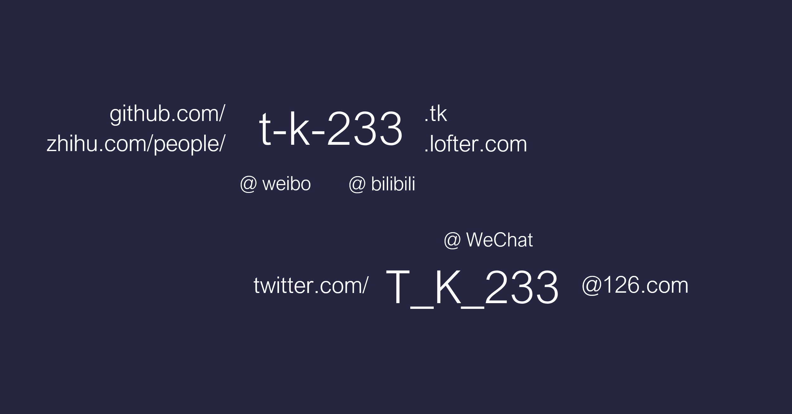

# -T.K.- 使用手册

## 简介

这里 -T.K.- 可简写为 TK。

目前是高三年级学生党

## 习性

下线时间具有很强的不确定性，在 21:00 ~ 0:00 这段时间内随机下线，上线时间一般为 7:00

每个月的第一天、每周一和每天早上都会进行一次「人生计划修正」

## 状态

#### 日常模式

日常模式下的 TK 会非常非常友善

对于别人的请求几乎可以做到有求必应

#### 好学生模式

好学生模式下的 TK 会具有很高的**学习效率**，刷**作业副本**的速度也会比平时快 1.5 倍左右

但该模式的有效时间最多为 4 小时

#### 码农模式

只有当集齐 SB、电源、外接键盘和鼠标时才能进入此模式

能够以每分钟 4-24 行的速度编写**代码**

这个模式也可以用于解决其他问题，比如**手工制作**、**视频剪辑**等，同样很高效

但此模式的副作用是在状态中的 TK 会加成 '**边缘人**' BUFF，几乎完全**与外界隔绝**

最大有效时间 3 小时

#### 逗比模式

#### 娱乐模式

#### 羁绊模式

正在开发中....

#### 丧模式

任何特殊模式被迫开启时间过长后会立即进入此模式

最大的特性就是非常**易怒**，容易**怀疑人生**并且工作效率下降到 10% 以下

## 技能

#### 无中生有

才不是三国杀中的无中生有呢！

能够通过资源的再分配实现 ‘无中生有’ 的效果

限定技，只有特定时间和地点才能够使用

#### 冷 · 场

被动技能，随机触发

使用对方资料库中 404 的信息导致冷场效果

线上线下都有可能触发

## 趣事

- 在社交媒体上的活跃度和心情成反比，心情越糟糕 pyq 的条数会越多

## 获取方法

